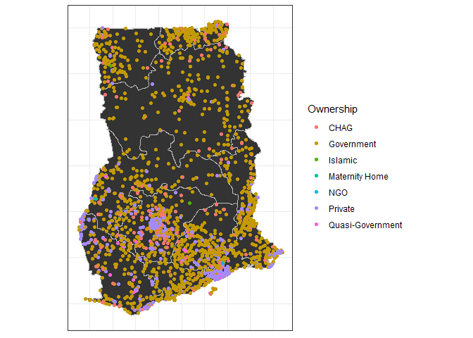

## Libraries to be used


```r
library(tidyverse)
library(rgdal)
```


##Skimming through the dataset

```r
str(hlth)
```

```
## 'data.frame':	3756 obs. of  8 variables:
##  $ Region      : Factor w/ 10 levels "Ashanti","Brong Ahafo",..: 1 1 1 1 1 1 1 1 1 1 ...
##  $ District    : Factor w/ 171 levels "Abura-Asebu-Kwamankese",..: 119 37 4 6 93 119 33 31 62 101 ...
##  $ FacilityName: Factor w/ 3544 levels "1000 Acre CHPS",..: 14 23 35 38 41 45 65 75 86 120 ...
##  $ Type        : Factor w/ 25 levels "Centre","CHPS",..: 4 4 9 9 9 9 11 4 9 9 ...
##  $ Town        : Factor w/ 2448 levels "","'Kulungungu",..: 157 354 33 34 38 40 63 72 80 114 ...
##  $ Ownership   : Factor w/ 12 levels "CHAG","Clinic",..: 1 11 4 4 4 4 11 1 4 4 ...
##  $ Latitude    : num  7.41 6.46 6.22 6.84 6.84 ...
##  $ Longitude   : num  -1.96 -1.59 -1.35 -1.61 -1.61 ...
```

Checking for missing values in each column

```r
hlth %>% 
  purrr::map_df(~sum(is.na(.)))
```

```
## # A tibble: 1 x 8
##   Region District FacilityName  Type  Town Ownership Latitude Longitude
##    <int>    <int>        <int> <int> <int>     <int>    <int>     <int>
## 1      0        0            0     0     0         0       24        24
```
24 missing coordinates of the health facilities

### Checking the levels of ownership

```r
levels(hlth$Ownership) 
```

```
##  [1] "CHAG"             "Clinic"           "government"      
##  [4] "Government"       "Islamic"          "Maternity Home"  
##  [7] "Mission"          "Muslim"           "NGO"             
## [10] "private"          "Private"          "Quasi-Government"
```
Need to streamline some of the levels


```r
hlth <- hlth %>% 
  mutate_at(.vars = vars(Ownership), .funs = forcats::fct_recode, Private = "private", Islamic = "Muslim", 
            Government = "government", Government = "Clinic", Islamic = "Mission") %>% 
  mutate_at(.vars = vars(Type), .funs = fct_recode, "Health Centre" = "Centre", CHPS ="CPHS", Clinic = "clinic",
            "District Health Directorate"= "DHD", "Reproductive and Child Health" = "RCH",
            "Municipal Health Directorate" = "Municipal  Health Directorate")
```


###Collapsing the health facilities into 4 categories

```r
hlth %>% 
  mutate_at(.vars = vars(Type), .funs = funs(nType = forcats::fct_collapse), 
            "health provider" = c("Health Centre", "CHPS",  "Clinic", "Hospital", "District Hospital", 
                                  "Metropolitan Hospital", "Municipal Hospital", "Regional Hospital", 
                                  "Teaching Hospital", "Maternity Home", "Reproductive and Child Health",
                                  "Psychiatric Hospital", "Polyclinic"),
            "directorate" = c("District Health Directorate", "Metropolitan Health Directorate", 
                              "Municipal Health Directorate", "Regional Health Directorate"),
            "training and research" = c("Training Institution", "Research Institution")) %>% 
  group_by(nType) %>% 
  summarise(n = n())
```

```
## # A tibble: 4 x 2
##   nType                     n
##   <fct>                 <int>
## 1 health provider        3530
## 2 directorate             119
## 3 Others                   31
## 4 training and research    76
```


```r
gh <- broom::tidy(gh_shp)
```

```
## Regions defined for each Polygons
```

```r
gh$id <- as.character(gh$id)
```


```r
ggplot()+
  geom_polygon(data = gh, aes(x = long, y = lat, group = group), colour = "grey") +
  geom_point(data = hlth, aes(x = Longitude, y = Latitude, colour = Ownership)) +
  coord_fixed(ratio = 1) +
  theme_bw() +
  theme(axis.text = element_blank(), # change the theme options 
        axis.title = element_blank(), # remove axis titles 
        axis.ticks = element_blank()) 
```

```
## Warning: Removed 24 rows containing missing values (geom_point).
```

<!-- -->


