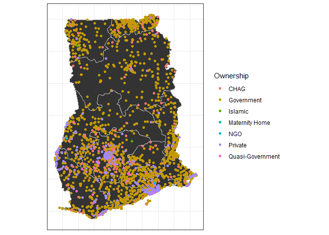
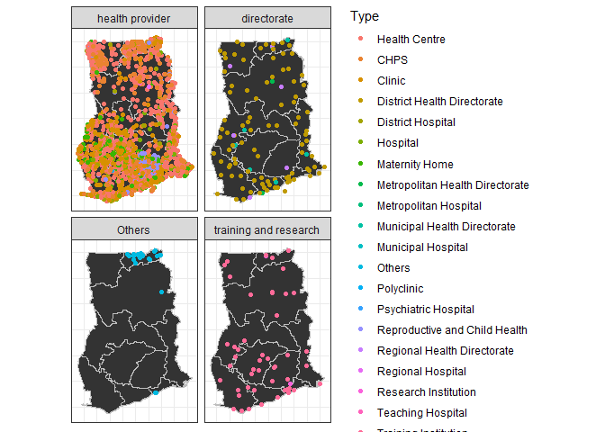
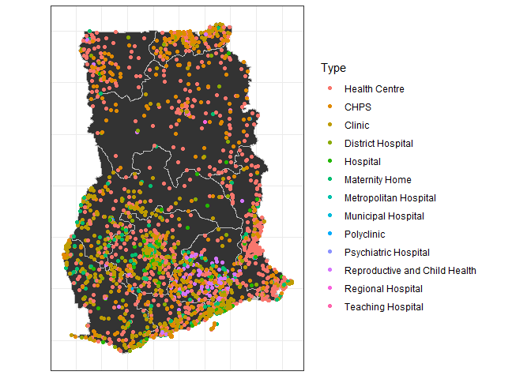
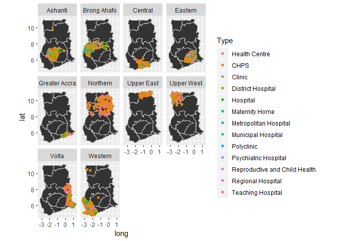

Ghana Health Facilities
================
Reginald Ziedzor
August 19, 2018

Libraries to be used
--------------------

``` r
library(tidyverse)
library(rgdal)
```

Skimming through the dataset
----------------------------

``` r
str(hlth)
```

    ## 'data.frame':    3756 obs. of  8 variables:
    ##  $ Region      : Factor w/ 10 levels "Ashanti","Brong Ahafo",..: 1 1 1 1 1 1 1 1 1 1 ...
    ##  $ District    : Factor w/ 171 levels "Abura-Asebu-Kwamankese",..: 119 37 4 6 93 119 33 31 62 101 ...
    ##  $ FacilityName: Factor w/ 3544 levels "1000 Acre CHPS",..: 14 23 35 38 41 45 65 75 86 120 ...
    ##  $ Type        : Factor w/ 25 levels "Centre","CHPS",..: 4 4 9 9 9 9 11 4 9 9 ...
    ##  $ Town        : Factor w/ 2448 levels "","'Kulungungu",..: 157 354 33 34 38 40 63 72 80 114 ...
    ##  $ Ownership   : Factor w/ 12 levels "CHAG","Clinic",..: 1 11 4 4 4 4 11 1 4 4 ...
    ##  $ Latitude    : num  7.41 6.46 6.22 6.84 6.84 ...
    ##  $ Longitude   : num  -1.96 -1.59 -1.35 -1.61 -1.61 ...

Checking for missing values in each column

``` r
hlth %>% 
  purrr::map_df(~sum(is.na(.)))
```

    ## # A tibble: 1 x 8
    ##   Region District FacilityName  Type  Town Ownership Latitude Longitude
    ##    <int>    <int>        <int> <int> <int>     <int>    <int>     <int>
    ## 1      0        0            0     0     0         0       24        24

24 missing coordinates of the health facilities

### Checking the levels of ownership

``` r
levels(hlth$Ownership) 
```

    ##  [1] "CHAG"             "Clinic"           "government"      
    ##  [4] "Government"       "Islamic"          "Maternity Home"  
    ##  [7] "Mission"          "Muslim"           "NGO"             
    ## [10] "private"          "Private"          "Quasi-Government"

Need to streamline some of the levels

``` r
hlth <- hlth %>% 
  mutate_at(.vars = vars(Ownership), .funs = forcats::fct_recode, Private = "private", Islamic = "Muslim", 
            Government = "government", Government = "Clinic", Islamic = "Mission") %>% 
  mutate_at(.vars = vars(Type), .funs = fct_recode, "Health Centre" = "Centre", CHPS ="CPHS", Clinic = "clinic",
            "District Health Directorate"= "DHD", "Reproductive and Child Health" = "RCH",
            "Municipal Health Directorate" = "Municipal  Health Directorate")
```

### Collapsing the health facilities into 4 categories

``` r
hlth <- hlth %>% 
  mutate_at(.vars = vars(Type), .funs = funs(nType = forcats::fct_collapse), 
            "health provider" = c("Health Centre", "CHPS",  "Clinic", "Hospital", "District Hospital", 
                                  "Metropolitan Hospital", "Municipal Hospital", "Regional Hospital", 
                                  "Teaching Hospital", "Maternity Home", "Reproductive and Child Health",
                                  "Psychiatric Hospital", "Polyclinic"),
            "directorate" = c("District Health Directorate", "Metropolitan Health Directorate", 
                              "Municipal Health Directorate", "Regional Health Directorate"),
            "training and research" = c("Training Institution", "Research Institution")) 

hlth%>% 
  group_by(nType) %>% 
  summarise(n = n())
```

    ## # A tibble: 4 x 2
    ##   nType                     n
    ##   <fct>                 <int>
    ## 1 health provider        3530
    ## 2 directorate             119
    ## 3 Others                   31
    ## 4 training and research    76

``` r
gh <- broom::tidy(gh_shp)
```

    ## Regions defined for each Polygons

``` r
gh$id <- as.character(gh$id)
```

Plotting the distribution of health facilities in Ghana

``` r
ggplot()+
  geom_polygon(data = gh, aes(x = long, y = lat, group = group), colour = "grey") +
  geom_point(data = hlth, aes(x = Longitude, y = Latitude, colour = Ownership)) +
  coord_fixed(ratio = 1) +
  theme_bw() +
  theme(axis.text = element_blank(), # change the theme options 
        axis.title = element_blank(), # remove axis titles 
        axis.ticks = element_blank()) 
```

    ## Warning: Removed 24 rows containing missing values (geom_point).



Finding the number of health facilities per region

``` r
hlth %>% 
  group_by(Region) %>% 
  summarise(n = n()) %>% 
  arrange(desc(n))
```

    ## # A tibble: 10 x 2
    ##    Region            n
    ##    <fct>         <int>
    ##  1 Ashanti         658
    ##  2 Greater Accra   504
    ##  3 Western         496
    ##  4 Volta           398
    ##  5 Eastern         393
    ##  6 Brong Ahafo     348
    ##  7 Central         299
    ##  8 Northern        267
    ##  9 Upper East      232
    ## 10 Upper West      161

### Breakdown of health facilities per region

``` r
hlth %>% 
  group_by(Region, nType) %>% 
  summarise(n = n()) %>% 
  spread(nType, n) %>% 
  as.data.frame()
```

    ##           Region health provider directorate Others training and research
    ## 1        Ashanti             642           4     NA                    12
    ## 2    Brong Ahafo             326          16     NA                     6
    ## 3        Central             278          16     NA                     5
    ## 4        Eastern             386           1     NA                     6
    ## 5  Greater Accra             472          12      2                    18
    ## 6       Northern             240          19      1                     7
    ## 7     Upper East             189           9     28                     6
    ## 8     Upper West             147          10     NA                     4
    ## 9          Volta             378          15     NA                     5
    ## 10       Western             472          17     NA                     7

This shows that the Ashanti Region has the highest number of health providers

### Breakdown of health facilities by Ownership per region

``` r
hlth %>% 
  group_by(Region, Ownership) %>% 
  summarise(n = n()) %>% 
  spread(key = Ownership,value = n) %>% 
  as.data.frame()
```

    ##           Region CHAG Government Islamic Maternity Home NGO Private
    ## 1        Ashanti   71        215       1             NA  NA     350
    ## 2    Brong Ahafo   20        246       1              2  NA      78
    ## 3        Central   16        226      NA             NA  NA      55
    ## 4        Eastern   25        275      NA             NA  NA      85
    ## 5  Greater Accra   13        103      NA             NA   2     360
    ## 6       Northern   28        224      NA             NA  NA      13
    ## 7     Upper East   23        195      NA             NA  NA      13
    ## 8     Upper West   12        138       2             NA  NA       9
    ## 9          Volta   19        306      NA             NA  NA      72
    ## 10       Western   30        289       2             NA  NA     146
    ##    Quasi-Government
    ## 1                21
    ## 2                 1
    ## 3                 2
    ## 4                 8
    ## 5                26
    ## 6                 2
    ## 7                 1
    ## 8                NA
    ## 9                 1
    ## 10               29

A further breakdown of the number of health providers show that the capital, Greater Accra, has the highest number of private health providers

``` r
ggplot()+
  geom_polygon(data = gh, aes(x = long, y = lat, group = group), colour = "grey") +
  geom_point(data = hlth, aes(x = Longitude, y = Latitude, colour = Type)) +
  coord_fixed(ratio = 1) +
  facet_wrap(~nType) +
  theme_bw() +
  theme(axis.text = element_blank(), # change the theme options 
        axis.title = element_blank(), # remove axis titles 
        axis.ticks = element_blank())
```

    ## Warning: Removed 24 rows containing missing values (geom_point).



Breaking down the health service providers in Ghana

``` r
ggplot() +
  geom_polygon(data = gh, aes(x = long, y = lat, group = group), colour = "grey") +
  geom_point(data = hlth[hlth$nType == "health provider",], aes(x = Longitude, y = Latitude, colour = Type)) +
  coord_fixed(ratio = 1) 
```

    ## Warning: Removed 23 rows containing missing values (geom_point).



``` r
ggplot() +
  geom_polygon(data = gh, aes(x = long, y = lat, group = group), colour = "grey") +
  geom_point(data = hh, aes(x = Longitude, y = Latitude, colour = Type)) +
  facet_wrap(~Region) +
  coord_fixed(ratio = 1)
```

    ## Warning: Removed 23 rows containing missing values (geom_point).



``` r
hlth %>% 
  filter(str_detect(Region, "Western"), Latitude > 6) %>% 
  arrange(desc(Latitude)) %>% 
  head()
```

    ##    Region          District                 FacilityName   Type    Town
    ## 1 Western Shama Ahanta East  Scho ol for the Deaf Clinic   CHPS Somboro
    ## 2 Western Shama Ahanta East             Infirmary Clinic   CHPS    Ping
    ## 3 Western               Bia                Presby Clinic Clinic        
    ## 4 Western               Bia    St. Luke Methodist Clinic Clinic        
    ## 5 Western               Bia St. John of God Clinic Annex Clinic        
    ## 6 Western               Bia           Kwasi Nkrumah CHPS   CHPS        
    ##          Ownership  Latitude Longitude           nType
    ## 1       Government 10.481920 -2.650360 health provider
    ## 2       Government 10.374670 -2.302880 health provider
    ## 3 Quasi-Government  6.966667 -1.266667 health provider
    ## 4 Quasi-Government  6.966667 -1.266667 health provider
    ## 5             CHAG  6.966667 -1.266667 health provider
    ## 6       Government  6.966667 -1.266667 health provider
